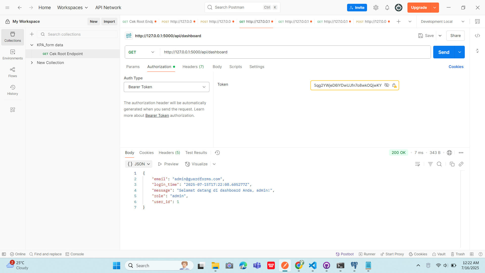
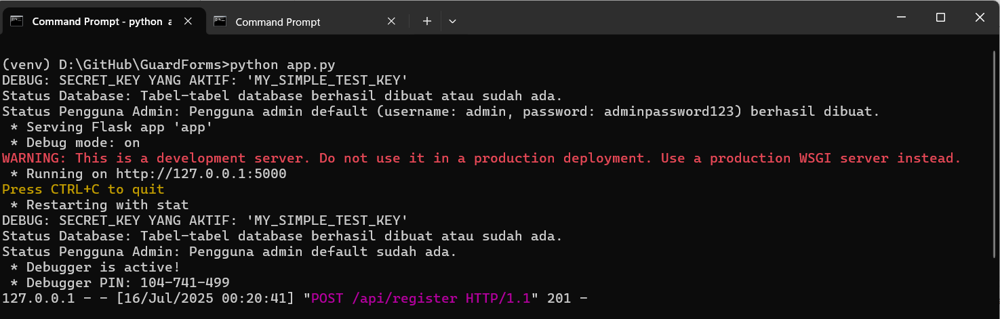

# 🛡 **GuardForms — Secure Data Sync & Audit System**

GuardForms adalah platform yang dirancang khusus untuk sinkronisasi data Google Forms secara aman ke PostgreSQL,  
dilengkapi audit log, otentikasi kuat, dan dashboard admin untuk monitoring aktivitas.

## ✨ Fungsi utama
✅ Fokus ke keamanan data & audit log  
✅ Sync Google Forms → PostgreSQL (tabel peserta, log aktivitas)  
✅ Otentikasi kuat: JWT, bcrypt hashing  
✅ Dashboard admin → lihat siapa login, siapa edit data  

## 🔧 Fitur tambahan
✨ Export data lengkap + audit trail  
✨ Multi-role user: admin, moderator, viewer  

---

## ⚙️ *Built with the tools and technologies:*

---

## 📸 Urutan Pengujian Postman

1. **Registrasi Pengguna Baru**
   

2. **Login Pengguna**
   

3. **Dashboard**
   

4. **Melihat Daftar Pengguna**
   

5. **Melihat Audit Log**
   

6. **Sinkronisasi Google Forms**
   

7. **Encode dan Decode Token**
   

8. **Run Project**
   

---

✅ Semua pengujian dilakukan menggunakan Postman dan hasilnya disimpan sebagai bukti dokumentasi.

